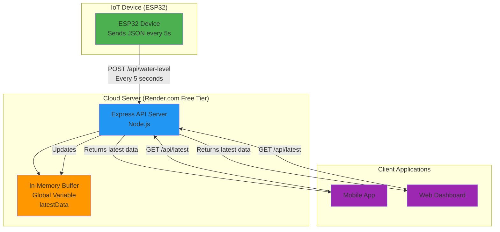

# IoT Pub/Sub API - Lightweight In-Memory Server

A production-ready, zero-cost Pub/Sub API server for IoT devices. Designed for high-frequency updates (every 5 seconds) with minimal overhead using an in-memory buffer.

## 🏗️ Architecture



### Key Components

1. **IoT Device (Publisher)**: ESP32 or similar device sends water level JSON data every 5 seconds via `POST /api/water-level`
2. **Server (Render.com)**: Express.js server running on free tier
3. **In-Memory Buffer**: Global variable storing only the most recent message (no database)
4. **Client (Subscriber)**: Mobile app or dashboard fetches latest data via `GET /api/latest`

### Why This Architecture?

- **Zero Cost**: Free tier hosting with no database fees
- **Low Latency**: In-memory access is instant
- **Simple**: No database setup or migrations
- **Auto-Awake**: 5-second intervals keep free server from sleeping
- **Stateless**: Each request is independent (except the buffer)

---

## 📋 Prerequisites

- Node.js 18+ installed locally
- npm or yarn
- Git installed
- GitHub account
- Render.com account (free)

---

## 🚀 Step-by-Step Deployment Guide

### Step 1: Initialize Project Locally

```bash
# Navigate to your project directory
cd /Users/ani/Documents/mycode/waterTankTrack

# Initialize npm (if not already done)
npm init -y

# Install dependencies
npm install express cors

# Test locally
npm start
```

Your server should start on `http://localhost:3000`. Test the endpoints:

```bash
# Health check
curl http://localhost:3000/health

# Update water level data (simulate IoT device)
curl -X POST http://localhost:3000/api/water-level \
  -H "Content-Type: application/json" \
  -d '{
    "deviceId": "ESP32_001",
    "distanceCm": "15.5",
    "waterLevelCm": "84.5",
    "waterPercentage": "75.5",
    "tankHeightCm": "100",
    "timestamp": "2024-01-15T10:30:45.123Z"
  }'

# Get latest data
curl http://localhost:3000/api/latest
```

### Step 2: Create GitHub Repository

1. **Create a new repository on GitHub:**
   - Go to [github.com](https://github.com) and click "New repository"
   - Name it `waterTankTrack` (or your preferred name)
   - Make it **public** (required for Render.com free tier)
   - **Do NOT** initialize with README, .gitignore, or license (we already have these)

2. **Connect local project to GitHub:**

```bash
# Initialize git (if not already done)
git init

# Add all files
git add .

# Commit
git commit -m "Initial commit: IoT Pub/Sub API server"

# Add remote (replace YOUR_USERNAME with your GitHub username)
git remote add origin https://github.com/YOUR_USERNAME/waterTankTrack.git

# Push to GitHub
git branch -M main
git push -u origin main
```

### Step 3: Deploy to Render.com

1. **Sign up/Login to Render:**
   - Go to [render.com](https://render.com)
   - Sign up with your GitHub account (recommended for seamless integration)

2. **Create a New Web Service:**
   - Click "New +" → "Web Service"
   - Connect your GitHub account if not already connected
   - Select your repository: `waterTankTrack`

3. **Configure the Service:**
   - **Name**: `iot-pubsub-api` (or your choice)
   - **Region**: Choose closest to your IoT devices
   - **Branch**: `main`
   - **Root Directory**: Leave empty (or `.` if required)
   - **Runtime**: `Node`
   - **Build Command**: `npm install` (or leave empty, Render auto-detects)
   - **Start Command**: `npm start`
   - **Plan**: **Free** (this is the zero-cost option)

4. **Environment Variables (Optional):**
   - You can add `NODE_ENV=production` if desired
   - No other variables needed for basic setup

5. **Click "Create Web Service"**
   - Render will clone your repo, install dependencies, and start the server
   - This takes 2-3 minutes on first deployment

6. **Get Your Live URL:**
   - Once deployed, you'll see a URL like: `https://iot-pubsub-api.onrender.com`
   - **Important**: On free tier, the first request after 15 minutes of inactivity may take 30-60 seconds (cold start)

### Step 4: Verify Deployment

Test your live server:

```bash
# Replace with your actual Render URL
BASE_URL="https://iot-pubsub-api.onrender.com"

# Health check
curl $BASE_URL/health

# Update water level data
curl -X POST $BASE_URL/api/water-level \
  -H "Content-Type: application/json" \
  -d '{
    "deviceId": "ESP32_001",
    "distanceCm": "15.5",
    "waterLevelCm": "84.5",
    "waterPercentage": "75.5",
    "tankHeightCm": "100",
    "timestamp": "2024-01-15T10:30:45.123Z"
  }'

# Get latest
curl $BASE_URL/api/latest
```

### Step 5: Configure IoT Device (ESP32 Example)

Update your ESP32 code to use the Render URL:

```cpp
// ESP32 Arduino example
#include <WiFi.h>
#include <HTTPClient.h>
#include <ArduinoJson.h>

const char* ssid = "YOUR_WIFI_SSID";
const char* password = "YOUR_WIFI_PASSWORD";
const char* serverURL = "https://iot-pubsub-api.onrender.com/api/water-level";

void setup() {
  Serial.begin(115200);
  WiFi.begin(ssid, password);
  
  while (WiFi.status() != WL_CONNECTED) {
    delay(500);
    Serial.print(".");
  }
  Serial.println("WiFi connected!");
}

void loop() {
  if (WiFi.status() == WL_CONNECTED) {
    HTTPClient http;
    http.begin(serverURL);
    http.addHeader("Content-Type", "application/json");
    
    // Create JSON payload (WaterLevelRequest structure)
    StaticJsonDocument<200> doc;
    doc["deviceId"] = "ESP32_001";
    doc["distanceCm"] = "15.5";
    doc["waterLevelCm"] = "84.5";
    doc["waterPercentage"] = "75.5";
    doc["tankHeightCm"] = "100";
    doc["timestamp"] = "2024-01-15T10:30:45.123Z";
    
    String jsonPayload;
    serializeJson(doc, jsonPayload);
    
    int httpResponseCode = http.POST(jsonPayload);
    
    if (httpResponseCode > 0) {
      Serial.print("HTTP Response code: ");
      Serial.println(httpResponseCode);
    } else {
      Serial.print("Error code: ");
      Serial.println(httpResponseCode);
    }
    
    http.end();
  }
  
  delay(5000); // Send every 5 seconds
}
```

---

## 🔄 Git-Based Deployment Workflow (Single Point of Truth)

### How It Works

1. **Local Development**: Make changes to `server.js` or other files
2. **Commit & Push**: Push to GitHub
3. **Auto-Deploy**: Render.com detects the push and automatically redeploys
4. **Live Update**: Your server updates within 2-3 minutes

### Example Workflow

```bash
# 1. Make changes to server.js
# Edit server.js in your editor

# 2. Test locally
npm start

# 3. Commit changes
git add server.js
git commit -m "Add new feature"

# 4. Push to GitHub
git push origin main

# 5. Render automatically deploys (check Render dashboard)
# 6. Test live URL after deployment completes
```

**Benefits:**
- ✅ Single source of truth (GitHub)
- ✅ Version control and rollback capability
- ✅ Automatic deployments
- ✅ No manual FTP or server access needed

---

## ⚡ Keeping Free Server "Awake"

### The Problem
Render.com free tier spins down services after **15 minutes of inactivity**. The first request after spin-down takes 30-60 seconds (cold start).

### The Solution
Your IoT device sends data **every 5 seconds**, which keeps the server active:

- ✅ Server receives requests every 5 seconds
- ✅ Never exceeds 15-minute inactivity window
- ✅ Server stays "warm" and responsive
- ✅ No cold start delays for your clients

### Monitoring
Check the `/health` endpoint to verify server is running:

```bash
curl https://your-app.onrender.com/health
```

If you see `"status": "healthy"` and a recent `timestamp`, your server is active.

---

## 📡 API Endpoints

### `POST /api/water-level`
Updates the in-memory buffer with new water level data from IoT device.

**Request:**
```bash
curl -X POST https://your-app.onrender.com/api/water-level \
  -H "Content-Type: application/json" \
  -d '{
    "deviceId": "ESP32_001",
    "distanceCm": "15.5",
    "waterLevelCm": "84.5",
    "waterPercentage": "75.5",
    "tankHeightCm": "100",
    "timestamp": "2024-01-15T10:30:45.123Z"
  }'
```

**Response:**
```
OK
```
(Plain text response, matches Java controller format)

### `GET /api/latest`
Returns the most recent data stored in the buffer.

**Request:**
```bash
curl https://your-app.onrender.com/api/latest
```

**Response:**
```json
{
  "success": true,
  "data": {
    "deviceId": "ESP32_001",
    "distanceCm": "15.5",
    "waterLevelCm": "84.5",
    "waterPercentage": "75.5",
    "tankHeightCm": "100",
    "timestamp": "2024-01-15T10:30:45.123Z"
  },
  "lastUpdate": "2024-01-15T10:30:45.123Z",
  "ageSeconds": 3
}
```

### `GET /health`
Health check endpoint with server status and uptime.

**Request:**
```bash
curl https://your-app.onrender.com/health
```

**Response:**
```json
{
  "status": "healthy",
  "uptime": "2d 5h 30m 15s",
  "uptimeSeconds": 189015,
  "timestamp": "2024-01-15T10:30:45.123Z",
  "serverStartTime": "2024-01-13T05:00:30.000Z",
  "memory": {
    "heapUsed": "15 MB",
    "heapTotal": "20 MB",
    "rss": "45 MB"
  },
  "hasData": true,
  "lastUpdate": "2024-01-15T10:30:42.000Z"
}
```

---

## 🔒 Security Considerations

For production use, consider adding:

1. **API Key Authentication**: Require an API key in headers for `/api/water-level`
2. **Rate Limiting**: Prevent abuse with `express-rate-limit`
3. **HTTPS**: Already provided by Render.com
4. **CORS Restrictions**: Limit CORS to specific origins instead of `*`

Example with API key:

```javascript
const API_KEY = process.env.API_KEY;

app.post('/api/water-level', (req, res) => {
  if (req.headers['x-api-key'] !== API_KEY) {
    return res.status(401).json({ error: 'Unauthorized' });
  }
  // ... rest of code
});
```

---

## 📊 Monitoring & Debugging

### View Logs on Render.com
1. Go to your service dashboard on Render.com
2. Click "Logs" tab
3. See real-time server logs and errors

### Local Testing
```bash
# Start server
npm start

# In another terminal, test endpoints
curl http://localhost:3000/health
```

---

## 🛠️ Troubleshooting

### Server Not Responding
- Check Render.com dashboard for deployment status
- Verify `npm start` command is correct
- Check logs for errors

### Cold Start Delays
- First request after 15 min inactivity may be slow
- Your 5-second interval should prevent this
- Consider upgrading to paid tier for always-on service

### CORS Issues
- Ensure CORS middleware is enabled
- Check browser console for specific errors

### Data Not Updating
- Verify IoT device is sending POST requests correctly
- Check server logs on Render.com
- Test with `curl` to isolate device issues

---

## 📝 File Structure

```
waterTankTrack/
├── server.js          # Main Express server
├── package.json       # Dependencies and scripts
├── .gitignore        # Git ignore rules
└── README.md         # This file
```

---

## 🎯 Next Steps

1. ✅ Deploy to Render.com
2. ✅ Configure your IoT device
3. ✅ Test with real data
4. 🔄 Monitor logs and performance
5. 🔄 Add authentication if needed
6. 🔄 Build mobile app/dashboard to consume `/api/latest`

---

## 📄 License

MIT License - Feel free to use this for your IoT projects!

---

## 🙏 Credits

Built as a lightweight, zero-cost solution for IoT Pub/Sub messaging using:
- **Express.js** - Web framework
- **Render.com** - Free hosting platform
- **Node.js** - Runtime environment

---

**Happy IoT Building! 🚀**


